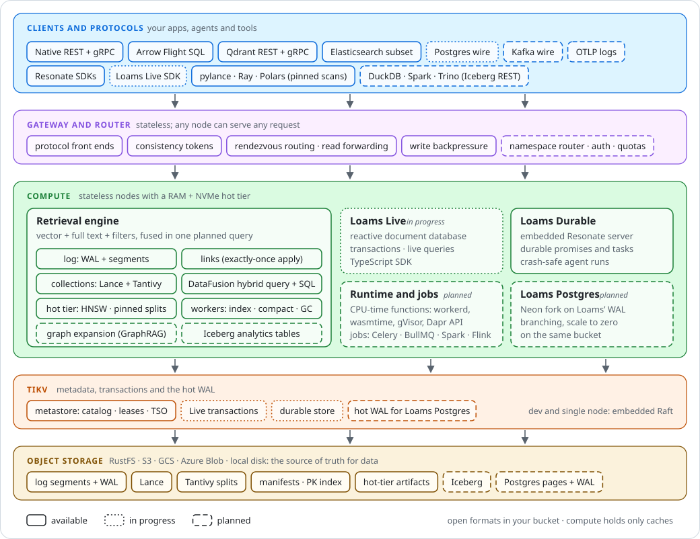

# Loams

**One bucket, every index: hybrid retrieval on object storage, with reactive data and durable agent runs beside it.**

Loams is an open-source, AI-native data platform built in Rust. It stores retrieval data in *your* object-storage bucket (RustFS, S3, GCS, Azure Blob or a local directory) in open formats: Lance and Tantivy today, Apache Iceberg next. Metadata lives in an embedded Raft metastore or in TiKV, and durable-execution state in SQLite (TiKV support is in progress). Retrieval compute is stateless and holds only caches, so it scales independently and can be replaced at any time.

> **Early and moving fast.** Loams has no stable release yet, and APIs, formats and flags change without notice. The crates are `loams-*` and the binary is `loams`; nothing is published yet. The design is public in [`docs/design`](docs/design/README.md).

[Documentation](docs/README.md) · [Website](https://loams.dev) · [API reference](https://loams.dev/api-docs) · [Contributing](CONTRIBUTING.md)

## Start here

| Your goal | Entry point |
|---|---|
| Build and run the engine | [Quick start](#quick-start) and [platform build guides](docs/build-from-source/README.md) |
| Understand the system | [Architecture](#architecture) and [design documents](docs/design/README.md) |
| Use a client | [API surfaces](#api-surfaces) and [SDKs](sdks/README.md) |
| Work on desktop, mobile, web, or plugins | [Monorepo guide](docs/monorepo.md) |
| Help ship Loams | [Contributing](CONTRIBUTING.md) and [implementation plans](docs/plans/README.md) |

## Why Loams

A typical production AI application runs Elasticsearch for keyword search, Qdrant for vectors, Neo4j for the knowledge graph, and Kafka for events, and often a workflow engine for agent runs too. That means four or five stateful clusters, several copies of the same data, connector pipelines between them, and retrieval logic glued together in application code across three network hops.

Loams replaces that stack with one engine on one bucket:

- **Object storage is the source of truth for data.** Documents, vectors, text indexes and the log live in open formats in your bucket. You pay object-storage prices, with no 3× block-storage replication, and losing a query node loses no data. Only the small metadata and transaction state lives elsewhere: in the embedded metastore or in TiKV.
- **The log is the spine.** Every write, whether native, Qdrant, Elasticsearch or Flight SQL, lands in a log first. Collections are materializations of that log, maintained by declarative *links*, so there is no connector zoo. Every write returns a **consistency token** that any later read can use to see it.
- **Hybrid retrieval as one planned query.** Dense vectors, BM25 full text and filters, fused with reciprocal rank fusion in one DataFusion plan. Graph expansion for GraphRAG is next.
- **Hot tiers where it matters.** Node-local, rebuildable acceleration in RAM and NVMe: HNSW graphs for vectors and pinned Tantivy splits for text, over a cheap durable tier on the bucket.
- **Drop-in where it helps adoption.** Existing Qdrant and Elasticsearch clients, and the LangChain and LlamaIndex integrations built on them, work unmodified against the subset Loams implements.
- **More than retrieval.** *Loams Live* is a reactive document database on TiKV. *Loams Durable* embeds a [Resonate](https://github.com/resonatehq/resonate) server, so agent runs survive crashes without repeating model calls.

Read the [pitch](docs/design/00-pitch.md) and the [architecture](docs/design/01-architecture.md) for the full reasoning.

## Architecture

<p align="center">
  
</p>

- **Clients and protocols.** The native REST API, Arrow Flight SQL, and the Qdrant and Elasticsearch APIs, with Postgres and Kafka wire protocols to come.
- **Gateway and router.** A stateless layer that speaks every protocol, issues consistency tokens and routes each request to the node that owns the data.
- **Compute.** The retrieval engine, which covers the log, links, collections, the query engine, the hot tier and background workers. Beside it run Loams Live, Loams Durable and, later, a CPU-time functions runtime, jobs and Loams Postgres.
- **TiKV.** Metadata (the catalog, leases and the timestamp oracle), Live's transactions, and a hot WAL. Single-node deployments use an embedded Raft metastore instead.
- **Object storage.** Log segments, Lance datasets, Tantivy splits, manifests and hot-tier artifacts. Iceberg tables and Postgres pages come later.

## Features

Statuses describe the engine implementation; consult the selected source ref and CI evidence. **Available** means it is built and tested in CI, not that it is production ready.

| Feature | What you get | Status |
|---|---|---|
| Collections | Documents with a schema, stored as Lance (vectors, columns) plus Tantivy (full text) under one manifest; upserts and deletes by id | Available |
| Hybrid retrieval | Vector kNN, BM25 and filters fused with RRF in one query; SQL table functions `vector_search`, `text_search` and `rrf` | Available |
| Native REST API | Namespaces, streams, collections, links, hybrid query and SQL | Available |
| Arrow Flight SQL | SQL and Arrow results for any language with an ADBC or Flight SQL driver | Available |
| Qdrant API | Qdrant REST and gRPC, tested with `qdrant-client` 1.15 and 1.19 | Available |
| Elasticsearch subset | Document APIs, `_bulk`, `_search` with the core Query DSL, `knn`, hybrid and RRF, tested with `elasticsearch-py` 8.19 | Available |
| Streams and links | Partitioned streams with a native produce and fetch API; links apply streams to targets exactly once | Available |
| Hot tier | HNSW vector artifacts and pinned text splits in RAM and NVMe, with delta indexes for fresh writes | Available |
| Pinned scans | Read a collection's pinned Lance version directly with pylance, Ray, Polars or PyTorch | Available |
| Cluster mode | `loams cluster` with roles, rendezvous placement, read forwarding and write backpressure | Available |
| TiKV metastore | The catalog, leases and timestamp oracle on TiKV (`--meta tikv://…`, cargo feature `tikv`) | Available (opt-in) |
| Loams Durable | An embedded Resonate server: durable promises and tasks on SQLite (cargo feature `durable`) | Available (opt-in) |
| Durable store on TiKV | Durable execution state on TiKV for clusters | In progress |
| Loams Live | A reactive document database on TiKV: transactions, indexes, live queries and a TypeScript SDK | In progress |
| Postgres and MySQL wire | SQL over the Postgres and MySQL wire protocols | In progress |
| Streaming gRPC API | Idempotent produce and streaming subscribe over gRPC | In progress |
| Web console | The Loams console and its design system, built against a mock of the console API | In progress |
| Graph expansion | GraphRAG expansion of 1 to 2 hops, planned together with the retrieval query | Planned |
| Iceberg analytics | Iceberg tables through a REST catalog, readable by DuckDB, Spark, Trino and ClickHouse | Planned |
| Kafka wire and OTLP | Kafka clients and OpenTelemetry logs ingest into streams | Planned |
| Auth and tenancy | API keys, authorization, tenant quotas and a namespace router | Planned |
| Native SDKs | Multi-language clients, generated API bindings, and shared runtime conformance fixtures; packages are not a stable published release | In progress |
| MCP and analytics helpers | Agent tools and convenience integrations such as `to_arrow()` and `to_polars()` | Planned |
| Loams Functions | A CPU-time serverless runtime on workerd, wasmtime and gVisor, with a Rust Dapr-style API | Planned |
| Loams Jobs | Celery, BullMQ v6, PySpark (through Sail) and Flink SQL (through RisingWave) jobs run durably on Loams | Planned |
| Loams Postgres | A fork of Neon whose WAL lives on TiKV and the bucket | Planned |
| Self-hosting with GitOps | A Helm chart, a Kubernetes operator and Argo CD layouts | Planned |

## Monorepo applications

This repository also contains [Loams Desktop](apps/desktop-electron/README.md) with its agent daemon ([`crates/loams-agentd`](docs/design/50-loams-desktop-daemon.md)),
[native Android/iOS apps](apps/mobile/README.md), and [plugin services and dashboard](plugins/README.md).
Nx coordinates Cargo, Gradle, Xcode/SwiftPM, Go, and the root pnpm workspace; it does not replace those build tools.

```sh
pnpm install --frozen-lockfile
pnpm projects
pnpm build
pnpm test
```

The default JavaScript checks do not require native toolchains. Build native apps separately with
`pnpm build:desktop`, `pnpm build:android`, or `pnpm build:ios` on a supported host.
See [the monorepo guide](docs/monorepo.md) for prerequisites, commands, migration provenance,
contract ownership, and current validation limits. Scoped licenses remain beside imported components.

## Quick start

### Prerequisites

- **Rust.** Install [rustup](https://rustup.rs); the toolchain pinned in [`rust-toolchain.toml`](rust-toolchain.toml) installs on first build.
- **protoc**, the Protocol Buffers compiler: `apt install protobuf-compiler`, `brew install protobuf`, or `pacman -S protobuf`.
- **Memory.** The first build compiles DataFusion, Lance and Tantivy, so it is heavy. On machines with less than 32 GB of RAM, limit parallel jobs with `-j 4`.

On **Windows** and **macOS** there are extra prerequisites — the MSVC Build Tools and NASM on Windows — and there are no binaries to download. See [`docs/build-from-source/`](docs/build-from-source/README.md).

### Run a dev server

`loams dev` runs everything in one process, with data in a local directory (`.loams/` by default):

```sh
cargo run --release -p loams -- dev
```

It serves these listeners, each of which you can move or turn off (`loams dev --help`):

| Surface | Default address | Flag |
|---|---|---|
| Native HTTP API | `127.0.0.1:8080` | `--listen` |
| Arrow Flight SQL | `127.0.0.1:8082` | `--flight-sql-listen`, `--no-flight-sql` |
| Qdrant REST and gRPC | `127.0.0.1:6333`, `127.0.0.1:6334` | `--qdrant-listen`, `--qdrant-grpc-listen`, `--no-qdrant` |
| Elasticsearch REST | `127.0.0.1:9200` | `--es-listen`, `--no-es` |
| Resonate (with `--features durable`) | `127.0.0.1:8001` | `--durable-listen`, `--no-durable` |

To run against a bucket instead of a local directory, use `loams standalone --bucket s3://bucket/prefix`. For a multi-node deployment, use `loams cluster`.

### Hybrid search with the native API

Create a collection, write documents and run a hybrid query. Every write returns a consistency token, and reads are strong by default, so they see the write at once.

```sh
curl -s localhost:8080/v1/namespaces/demo/collections -H 'content-type: application/json' -d '{
  "name": "kb",
  "schema": {
    "fields": [
      {"name": "body", "source_path": "body", "kind": {"text": {"analyzer": "standard", "positions": true}}, "indexed": true, "fast": false},
      {"name": "tenant", "source_path": "tenant", "kind": "keyword", "indexed": true, "fast": true}
    ],
    "vectors": [{"name": "embedding", "dim": 3, "distance": "cosine"}],
    "sparse_vectors": [], "dynamic": "ignore", "max_fields": 1000
  }
}'

curl -s localhost:8080/v1/namespaces/demo/collections/kb/documents -H 'content-type: application/json' -d '{"ops": [
  {"upsert": {"id": 1, "source": {"body": "refund policy", "tenant": "a"}, "vectors": {"embedding": [1.0, 0.0, 0.0]}}},
  {"upsert": {"id": 2, "source": {"body": "shipping times", "tenant": "a"}, "vectors": {"embedding": [0.9, 0.1, 0.0]}}},
  {"upsert": {"id": 3, "source": {"body": "refund window", "tenant": "b"}, "vectors": {"embedding": [0.0, 0.0, 1.0]}}}
]}'

curl -s localhost:8080/v1/namespaces/demo/query -H 'content-type: application/json' -d '{
  "from": "collections.kb",
  "retrieve": [
    {"vector": {"field": "embedding", "query": [1.0, 0.0, 0.0], "k": 10}},
    {"text": {"field": "body", "query": "refund", "k": 10}}
  ],
  "filter": {"term": {"tenant": "a"}},
  "fuse": {"method": "rrf", "k": 60},
  "limit": 3
}'
```

The same query in SQL:

```sh
curl -s localhost:8080/v1/namespaces/demo/sql -H 'content-type: application/json' -d @- <<'JSON'
{"query": "SELECT _id, body, _score FROM rrf(vector_search('kb', [1.0, 0.0, 0.0], 'embedding', 10), text_search('kb', 'refund', 'body', 10)) LIMIT 3"}
JSON
```

### Use an existing Qdrant client

```python
# pip install qdrant-client
from qdrant_client import QdrantClient, models

client = QdrantClient(url="http://localhost:6333")
client.create_collection("docs", vectors_config=models.VectorParams(size=3, distance=models.Distance.COSINE))
client.upsert("docs", points=[models.PointStruct(id=1, vector=[1.0, 0.0, 0.0], payload={"title": "refunds"})], wait=True)
print(client.query_points("docs", query=[1.0, 0.0, 0.0], limit=1))
```

Requests without a `Loams-Namespace` header go to the `default` namespace. The Elasticsearch API on port 9200 works the same way with `elasticsearch-py`.

### Query over Flight SQL

```python
# pip install adbc-driver-flightsql pyarrow
import adbc_driver_flightsql.dbapi as flight_sql

with flight_sql.connect(
    "grpc://127.0.0.1:8082",
    db_kwargs={"adbc.flight.sql.rpc.call_header.loams-namespace": "demo"},
) as conn, conn.cursor() as cur:
    cur.execute("SELECT _id, body FROM kb ORDER BY _id")
    print(cur.fetch_arrow_table())
```

### Read the bucket directly

`POST /v1/namespaces/{ns}/collections/{c}/scan` returns a pinned Lance version, which pylance reads straight from the bucket (`pip install pylance==12.0.0`):

```python
import json, urllib.request
import lance

request = urllib.request.Request(
    "http://127.0.0.1:8080/v1/namespaces/demo/collections/kb/scan",
    data=b"{}", headers={"content-type": "application/json"},
)
plan = json.load(urllib.request.urlopen(request))
if plan["lance"] is not None:  # null until the first commit
    dataset = lance.dataset(plan["lance"]["uri"], version=plan["lance"]["version"])
    print(dataset.count_rows(), "live documents; tail:", plan["tail_records"], "records")
```

Writes that the pinned version does not hold yet (the plan's *tail*) are readable through the native API or Flight SQL.

## API surfaces

| Surface | Protocol | Use it for | Code |
|---|---|---|---|
| Native API | REST (JSON) | Namespaces, streams, collections, links, hybrid query, SQL, scan plans | [`crates/loams/src/api`](crates/loams/src/api) |
| Flight SQL | Arrow Flight over gRPC | SQL from any ADBC or Flight SQL client, with Arrow results | [`crates/loams`](crates/loams) |
| Qdrant | REST and gRPC | Existing Qdrant clients and framework integrations | [`crates/loams-qdrant`](crates/loams-qdrant) |
| Elasticsearch subset | REST (JSON, NDJSON) | Existing Elasticsearch 8 clients, LangChain and LlamaIndex stores | [`crates/loams-es`](crates/loams-es) |
| Resonate | HTTP | Durable promises and tasks from the Resonate SDKs (TypeScript, Python, Rust, Go, Java) | [`crates/loams-durable`](crates/loams-durable) |
| Loams Live | Connect / gRPC (`loams.live.v1`) | Reactive documents and live queries (in progress) | [`proto/loams`](proto/loams), [`sdks/typescript`](sdks/typescript) |
| Console API | REST (OpenAPI) | The web console (in progress, served by a mock for now) | [`api/console`](api/console) |

Each gateway documents where it differs from the original in its crate's module docs.

## Project layout

| Crate | What it does |
|---|---|
| [`loams`](crates/loams) | The server binary: the native HTTP API, Flight SQL, the gateways, and the `dev`, `standalone` and `cluster` commands |
| [`loams-common`](crates/loams-common) | Identifier and schema types shared by all crates |
| [`loams-store`](crates/loams-store) | Object-storage access: conditional writes, range reads and fault injection |
| [`loams-cache`](crates/loams-cache) | Read-through RAM + NVMe byte-range cache over immutable objects |
| [`loams-meta`](crates/loams-meta) | The embedded metastore on Raft: namespaces, streams, the sequencer, leases and pointers |
| [`loams-meta-tikv`](crates/loams-meta-tikv) | The metastore on TiKV |
| [`loams-meta-conformance`](crates/loams-meta-conformance) | A backend-agnostic conformance suite for the metastore (test only) |
| [`loams-tikv`](crates/loams-tikv) | The TiKV client layer: transactions, the timestamp oracle, keyspace bootstrap and the cluster GC loop |
| [`loams-tuple`](crates/loams-tuple) | The order-preserving tuple codec of index keys, shared by `loams-kv` and `loams-tikv` |
| [`loams-log`](crates/loams-log) | The internal log: WAL objects, segments, the write and fetch paths, and retention |
| [`loams-worker`](crates/loams-worker) | Lease-fenced background tasks with priorities and fair share |
| [`loams-link`](crates/loams-link) | Links: exactly-once apply of streams into targets |
| [`loams-pk`](crates/loams-pk) | The primary-key index on SlateDB |
| [`loams-collection`](crates/loams-collection) | Collections: documents, the catalog, and Lance + Tantivy storage under one manifest |
| [`loams-text`](crates/loams-text) | Tantivy integration: analyzers, splits on object storage and delete bitmaps |
| [`loams-quickwit`](crates/loams-quickwit) | Quickwit's split, directory, query and merge-policy code, vendored and adapted |
| [`loams-query`](crates/loams-query) | The read side: the search IR, hybrid query planning, SQL and the tail |
| [`loams-hnsw`](crates/loams-hnsw) | HNSW index traits, an exact flat engine and the qdrant-edge engine |
| [`loams-hot`](crates/loams-hot) | The hot tier: HNSW artifacts, pinned splits, budgets, placement and read forwarding |
| [`loams-qdrant`](crates/loams-qdrant) | The Qdrant-compatible REST and gRPC gateway |
| [`loams-es`](crates/loams-es) | The Elasticsearch-compatible REST gateway |
| [`loams-durable`](crates/loams-durable) | Loams Durable: the Resonate server embedded in process |
| [`loams-kv`](crates/loams-kv) | Loams Live's store seam: transactions, snapshots and timestamps over an embedded backend or TiKV |
| [`loams-live`](crates/loams-live) | Loams Live: the reactive document database on TiKV |
| [`loams-live-proto`](crates/loams-live-proto) | Loams Live's `loams.live.v1` protos and generated service code |
| [`loams-sim`](crates/loams-sim) | Seeded cluster simulation and a linearizability checker (test only) |
| [`loams-console-mock`](crates/loams-console-mock) | The console API's contract and seed data, served over REST by `loams-apps-mock` |

Other directories:

| Path | Contents |
|---|---|
| [`docs/design`](docs/design/README.md) | The design documents and the decision log |
| [`docs/plans`](docs/plans/README.md) | Implementation plans, task by task |
| [`web`](web/README.md) | The web console and the `@loams/ui` design system |
| [`sdks`](sdks) | Client SDKs (the Loams Live TypeScript SDK) |
| [`proto`](proto), [`api`](api) | Protobuf and OpenAPI contracts |
| [`fabric`](fabric) | The `fabric/` workspace: Loams Flow's event fabric and its connectors (design §32, §33) |
| [`connectors`](connectors) | The connector registry: the 200-row catalog, the manifests and their JSON Schemas (§33) |
| [`conformance`](conformance) | External client conformance suites |
| [`deploy`](deploy) | Local compose files for TiKV and companion services |
| [`scripts`](scripts) | Development and CI helper scripts |

## Roadmap

In order: hybrid retrieval hardened for production (auth, quotas, telemetry, multi-node clusters, the Kubernetes operator), then graph expansion, streams with Kafka compatibility, and Iceberg analytics. Loams Live, Loams Durable, the functions runtime, jobs and Loams Postgres advance on their own tracks. The details, with exit criteria for each stage, are in [the roadmap](docs/design/12-roadmap-testing-risks.md) and [the implementation plans](docs/plans/README.md). Architectural decisions are recorded in [the decision log](docs/design/13-decision-log.md).

## Contributing

Contributions of every size are welcome: bug reports, compatibility reports from your Qdrant or Elasticsearch client, docs fixes, tests and code.

- Read [CONTRIBUTING.md](CONTRIBUTING.md) for the dev setup, tests and the PR flow.
- Look for issues labelled [`good first issue`](https://github.com/ostrium-labs/loams/issues?q=is%3Aissue+is%3Aopen+label%3A%22good+first+issue%22) or [`help wanted`](https://github.com/ostrium-labs/loams/issues?q=is%3Aissue+is%3Aopen+label%3A%22help+wanted%22).
- For anything that changes a format, a protocol or a design decision, open an issue first.

## Community

- **Questions and ideas:** [GitHub Discussions](https://github.com/ostrium-labs/loams/discussions). **Bugs and RFCs:** [GitHub issues](https://github.com/ostrium-labs/loams/issues).
- **Security issues:** please report them privately, as described in [SECURITY.md](SECURITY.md).
- **Conduct:** everyone who takes part agrees to the [Code of Conduct](CODE_OF_CONDUCT.md).
- **Governance and maintainers:** [GOVERNANCE.md](GOVERNANCE.md) and [MAINTAINERS.md](MAINTAINERS.md).
- **Wiki:** [guides and overviews](https://github.com/ostrium-labs/loams/wiki).
- **Roadmap board:** [Loams Roadmap](https://github.com/orgs/ostrium-labs/projects).
- **Build on Loams:** [ECOSYSTEM.md](ECOSYSTEM.md) (upstream first), the [trademark policy](TRADEMARKS.md) and [Deploy buttons](docs/ecosystem/deploy-buttons.md).
- **Publish to the marketplace:** [the developer guide](docs/marketplace/publishing.md).
- **Release Loams itself:** [the registries, secrets and release path](docs/release/publishing.md) (nothing is published yet).
- **Build from source on Windows or macOS:** [the build-from-source guides](docs/build-from-source/README.md). There are no Windows or macOS binaries and none are signed, so this is the only way to get one on those platforms.
- **Sponsor** the maintainers through the Sponsor button once their GitHub Sponsors profiles are live.

## Built on

Loams builds on great open-source work, including [DataFusion](https://datafusion.apache.org), [Lance](https://github.com/lancedb/lance), [Tantivy](https://github.com/quickwit-oss/tantivy), [Quickwit](https://github.com/quickwit-oss/quickwit), [qdrant-edge](https://github.com/qdrant/qdrant), [SlateDB](https://slatedb.io), [openraft](https://github.com/databendlabs/openraft), [TiKV](https://tikv.org) and [Resonate](https://github.com/resonatehq/resonate). Where Loams needs patches before upstream ships them, it uses pinned forks under [ostrium-labs](https://github.com/ostrium-labs): [resonate](https://github.com/ostrium-labs/resonate), [client-rust](https://github.com/ostrium-labs/client-rust), [loams-postgres](https://github.com/ostrium-labs/loams-postgres) (Loams Postgres, a hard fork of Neon) and [sqlx](https://github.com/ostrium-labs/sqlx). Attributions are in [NOTICE](NOTICE).

## License

Loams is licensed under the [Apache License 2.0](LICENSE). See [NOTICE](NOTICE) for third-party attributions.

**Open core.** Everything you need to self-host Loams for a single organisation is open source in this repository. The **Multitenant BYOC Control Plane with GitOps** (multi-tenancy, Knative, Argo CD, Authentik, bring-your-own-cloud) is open source too. Only metering, billing and the commercial APIs live in a separate, proprietary platform, because usage figures and paid endpoints must not be open to manipulation (integrity is the security principle). The boundary is spelled out in [docs/open-core.md](docs/open-core.md).
