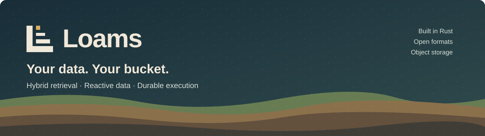

# Implementation Plans

Each plan is a sequence of test-driven tasks that ends in working, tested software. Plans are written just before they're executed, so they match the real code that exists by then. The M0.1 and M0.2 plans contain code compiled and tested in a scratch copy before publication. From M0.3 on, plans specify the exact formats, interfaces, rulings and required tests; the code is written test-first during execution and checked by an independent whole-branch review (M0.3 plan, Ruling 1).

Execute a plan task by task with `superpowers:subagent-driven-development` (recommended) or `superpowers:executing-plans`.

## Milestone M0: Foundation

Design references: [01 Architecture](../design/01-architecture.md), [02 Stream engine](../design/02-stream-engine.md), [03 Storage formats](../design/03-storage-formats.md), [04 Hot tier](../design/04-hot-tier.md), [09 Links & workers](../design/09-links-and-workers.md), [12 Roadmap](../design/12-roadmap-testing-risks.md).

| Plan | Scope | Status |
|---|---|---|
| [M0.1: Workspace & storage primitives](2026-09-23-m0.1-storage-primitives.md) | Cargo workspace, CI, license policy; `loams-store` (conditional writes, range reads, URL backends, fault injection); `loams-cache` (RAM + NVMe range cache with checksums) | **Done** |
| [M0.2: Metastore](2026-09-23-m0.2-metastore.md) | `loams-common` ids; `loams-meta` on openraft: namespaces, streams, sequencer and offset index, leases with epochs, fenced manifest-pointer CAS; Raft log in redb, snapshots in object storage; single-node and in-process 3-node clusters | **Done** |
| [M0.3: Log engine](2026-09-24-m0.3-log-engine.md) | WAL object and segment formats (with the `encoding` field reserved, D20); leaderless `standard` write path; fetch path; segmenter; native produce/fetch API; `loams dev` binary. In meta: segment index swap, WAL-commit pruning, retention trim, offset watch for long-poll | **Done** |
| [M0.4: Workers, links & M0 gates](2026-09-24-m0.4-workers-links-gates.md) | Worker leases and task framework; link framework with exactly-once apply; `PkIndex` on SlateDB; GC; seeded simulation harness with linearizability checks; M0 crash and fault exit gates | **Done** |

**M0 is done.** The exit gates and their results are in the [M0 exit report](m0-exit-report.md).

## Milestone M1: Collections (Qdrant + Elasticsearch subset + Flight SQL)

Design references: [03 Storage formats](../design/03-storage-formats.md) §3, [04 Hot tier](../design/04-hot-tier.md), [05 Query engine](../design/05-query-engine.md), [06 Search & vector](../design/06-search-and-vector.md), [09 Links & workers](../design/09-links-and-workers.md), [12 Roadmap](../design/12-roadmap-testing-risks.md), [15 Agent workspaces](../design/15-agent-workspaces.md) §10.1.

Start with the **[M1 overview](m1-overview.md)**. It fixes the contracts every M1 plan shares: crates, the collection catalog, the record format, the manifest, consistency tokens, the search IR and `CollectionService`, along with rulings R1–R22 and amendments A1–A32 (A26–A32 record the owner decisions of 2026-09-25: Qdrant sparse vectors in M1, the elasticsearch-py wipe endpoints, and the Loams rename after M1). Where a plan and the overview disagree, the overview wins. **The rename and the first publish:** the first crates.io publish follows the rename PR (A32, D33, D407), as `loams` (the owner's 2026-10-01 ruling D400 replaces A32's `loams`; the binary is `loams`, D401, and the repository becomes `ostrium-labs/loams` after it, D406). The `loams` crate has optional dependencies on the TiKV crates (features `tikv`, and `live` from R1 Task 12, both off by default), and `cargo publish` needs every optional dependency on crates.io too, while those crates depend on the git-pinned `tikv-client` (R1 rows R4, T7-3). So at the rename, either publish the TiKV crates as well, if `tikv-client` has released the fixes the pin carries, or strip the `tikv` and `live` features from the published manifest; nothing is needed before then (owner ruling, R1 row T8-1). The [M1 dependency spike](m1-dependency-spike.md) records the dependency set that was verified to build together, including the fact that Lance 12 pins DataFusion 54 and arrow 58.

Only M1.1 and M1.2a were written against code that existed. Each later plan starts with a Task 0 that reconciles it with the as-built code of the plans it depends on; the rulings M1.1 made during execution (its plan's "Rulings made during execution") are the as-built reference for M1.2's Task 0.

| Plan | Scope | Depends on | Status |
|---|---|---|---|
| [M1.1: Collection storage](2026-09-24-m1.1-collection-storage.md) | Collection catalog, `DocOp` records, atomic multi-partition append, Lance (detached versions) + Tantivy splits under one manifest, upserts/deletes via the PK index, the collection link target, index builds, GC roots, gates | M0 | **Done** |
| [M1.2a: `MetaStore` trait](2026-09-25-m1.2a-metastore-trait.md) | `trait MetaStore` in `loams-common` (D47); shared metastore types moved (encoding unchanged); the openraft `MetaClient` as the first implementation; every downstream crate on `Arc<dyn MetaStore>`; the backend-agnostic conformance suite with linearizability checks; M0 and M1.1 gates re-run unchanged | M1.1 | **Done** |
| [M1.2: Query engine and native API](2026-09-24-m1.2-query-engine.md) | Search IR, DataFusion operators, tail index, strong reads, global BM25 statistics, `CollectionService`, native REST, SQL UDTFs, Flight SQL with `DoPut` bulk ingest (D49), scan pinning (D53), Spice-named SQL search functions (D56) | M1.2a | **Done** |
| [M1.3: Hot tier, maintenance and affinity routing](2026-09-24-m1.3-hot-tier-routing.md) | Split merges, Lance compaction, qdrant-edge HNSW artifacts, pinned splits, the metastore over the network, node registry, rendezvous routing, the hot on/off differential harness; the unapplied-data budget and write backpressure (Task 15, added 2026-09-26, D86) | M1.2 | **Done** |
| [M1.4: Qdrant API Phase A](2026-09-24-m1.4-qdrant-api.md) | REST 6333 + gRPC 6334 over `CollectionService`, sparse vectors included; the Python `qdrant-client` 1.15.1 and 1.19.1 in CI | M1.2 | **Done** |
| [M1.5: Elasticsearch API Phase A](2026-09-24-m1.5-elasticsearch-api.md) | REST 9200, trimmed to what the LangChain and LlamaIndex suites and BEIR send (D48): document APIs, `_bulk`, `_search` and `_msearch` with the core DSL, `knn`, hybrid + RRF, `_delete_by_query`, minimal index admin, multi-target aliases (D57); native delete-by-filter and patch-by-filter and `_update_by_query` (Task 9a, added 2026-09-26, D87) | M1.2 | **Done** |
| [M1.6: SDKs and MCP server](2026-09-24-m1.6-sdks-mcp.md) | Python and TypeScript SDKs (with `to_arrow()`/`to_polars()` and scan plans, D54), the W0 MCP server (2026-07-28 stateless spec); the per-response `performance` block, SDK filter writes and 429 retries, the OpenAPI spec (Tasks 10–12, added 2026-09-26, D92, D101) | M1.2 | Planned |
| [M1.7: M1 exit gates](2026-09-24-m1.7-exit-gates.md) | LangChain/LlamaIndex suites, ADBC Flight SQL drivers (D49), Spice's Flight SQL connector (D56), BEIR vs ES BM25, Recall@10 vs Qdrant, hot on/off identity at scale, the M1 exit report; the recall endpoint and the published limits page (Tasks 10–11, added 2026-09-26, D92, D88) | M1.3–M1.6 | Planned |

M1.4, M1.5 and M1.6 can run in parallel once M1.2 is merged.

## PG: Postgres wire access (after M1)

Spike and decision: [Postgres wire spike](pgwire-spike.md) (D-PG-1, numbered at merge). Serves collections over the Postgres protocol through `datafusion-postgres`: read-only first, then writes behind `--pg-allow-writes`. It is analytical and ingest access; OLTP clients use Loams Live / TiDB.

| Plan | Scope | Depends on | Status |
|---|---|---|---|
| [PG1: Postgres wire access over collections](2026-09-28-pg1-postgres-wire.md) | Tasks 0–5, read-only: upstream `arrow-pg`/DataFusion-feature fixes, the loopback listener in `Server`, per-connection sessions (database = namespace, consistency tokens), catalog polish, `COPY TO`, a psql/psycopg/node-postgres CI job. Tasks 6–10, writes behind `--pg-allow-writes`: one-write autocommit transactions, `INSERT`/`ON CONFLICT`, `UPDATE`/`DELETE` through filter writes (D87), `COPY FROM STDIN` through the bulk path, a differential against REST writes | M1.2 (read-only half); M1.5 Task 9a (Task 8); slot: after M1.7, before M2 | Planned |

## Track PG2: Loams Postgres, serverless Postgres on the bucket routed by PgDog

Design reference: [46 Loams Postgres in production](../design/46-loams-postgres-production.md) (D700–D719, Q640–Q654), on [28 Loams Postgres](../design/28-loams-postgres.md). Loams Postgres is the `dina-kar/neon` fork under Loams’ control plane (`loams.postgres.v1`, `pg-control`), with **PgDog** (unmodified, AGPL-3.0, one Deployment per namespace) as the front door: routing, pooling, TLS, SCRAM, credential exchange for OIDC and agent tokens, and wake-on-connect through a Loams waker. PG2a–PG2c implement §28's P2b and P3. Under the owner's directive of 2026-10-08 ("remove safekeepers"), `loams-wal` is the only WAL, and PG2d, which makes it meet absolute launch targets, is launch-critical. PG2 is unrelated to PG1 above: the engine's read-only `--pg-listen` is not Loams Postgres. One plan, six milestones, Tasks 0–60; the exit is §46 §17.

| Plan | Scope | Depends on | Status |
|---|---|---|---|
| [PG2: Loams Postgres to production](2026-10-08-pg2-postgres-production.md), PG2a (Tasks 0–9) | Reconcile; `loams.postgres.v1` protos, reasons and route map; `loams-neon`; `PgControlStore` (TiKV and local redb) with one conformance suite; ids and the routed-name grammar; projects, branches, roles, databases with idempotency and operations; fenced reconcilers; the Neon upcall API; authz, audit and the `pg-control` role behind the `postgres` feature | §28 P2a fork images (digests pinned in Task 0); MT1 for OpenFGA (dev authorizer until then) | Planned |
| [PG2: Loams Postgres to production](2026-10-08-pg2-postgres-production.md), PG2b (Tasks 10–17) | `ComputeRuntime` (compose, Kubernetes Pods and endpoint Services); the endpoint state machine; idle suspend and `ComputeLifecycleObserver`; the warm pool; the autoscaler (in-place Pod resize and file-cache resize); read-only endpoints and promotion; the cold-start harness | PG2a | Planned |
| [PG2: Loams Postgres to production](2026-10-08-pg2-postgres-production.md), PG2c (Tasks 18–29) | The PgDog verification spike (Q640–Q643) and pin; licence checks in CI; per-namespace rendering (with RT1's renderer), the `pgdog-config-sync` sidecar and `RELOAD`; per-namespace Deployments and the L4 SNI listener; TLS on both hops; SCRAM; `IssueConnectCredential`; the waker (wake-on-connect); health, failover and read routing; PgDog metrics; the router inventory re-blessed against Loams Postgres, and the driver and ORM matrix | PG2b; RT1's renderer, admin adapter and `ConfigPush`; MT4's tenant renderer (Helm fallback) | Planned |
| [PG2: Loams Postgres to production](2026-10-08-pg2-postgres-production.md), PG2d (Tasks 30–43), **launch-critical** | `loams-wal` as the only WAL: stage timing and an absolute gate; the in-process interpreted sender (the feeder and its safekeeper go); broker publication; `bulk` throughput diagnosed and fixed; pipelined and batched TiKV appends; TiKV raw against txn, leader placement and Raft ticks; shared SQPOLL, off by default; metrics, TLS and tokens; HA, membership, fencing and pool moves; offload, recover-from-bucket and the archive restore; nemesis and `loams-detsim`; the store bake-off and the launch gate run (Q652); dev data migration and safekeepers removed from dev | `loams-safekeeper`; the `loam-bench` runner; RT1's `loams-detsim` | Planned |
| [PG2: Loams Postgres to production](2026-10-08-pg2-postgres-production.md), PG2e (Tasks 44–55) | PITR and restore; bucket versioning and the restore drill; `loams_pg_*` metrics, traces, dashboards and alerts; quotas; the Helm chart through Argo CD and Flux waves; storage HA; rolling upgrades and major-version upgrade; the failure table and the 72 h chaos soak; the threat model and the external security review; the performance gate run; `pg_regress` and extensions | PG2c; MT3 waves; MT4 limits record (deployment-config fallback) | Planned |
| [PG2: Loams Postgres to production](2026-10-08-pg2-postgres-production.md), PG2f (Tasks 56–60) | `loams dev --postgres` single-node mode (local store, compose runtime, local-filesystem remote storage, one `loams-wal` acceptor, PgDog); advertising `loams.postgres.v1` and the CLI; the desktop `PostgresBackend` contract and the switch from D668's local stack to the API; runbooks and docs | Task 10 (PG2b), Task 22 (PG2c), Task 43 (PG2d); AP1e Tasks 21–23 merged before Tasks 58–59 | Planned |

## Track R: Loams Live, TiDB SQL and the TiKV metastore (parallel to M1)

Design reference: [20 Loams Live: reactive database on TiKV](../design/20-reactive-database-on-tikv.md) (D116–D131). Track R runs beside M1 and M2, interleaved with them because the build machine builds one crate graph at a time (D127).

| Plan | Scope | Depends on | Status |
|---|---|---|---|
| [R1: TiKV metastore and the reactive core](2026-09-27-r1-reactive-core.md) | `loams-tikv` (client layer, keyspace bootstrap, fault hooks, GC loop); `loams-meta-tikv` with conformance and fault matrix (D124); `loams-live`: documents, indexes, the commit journal, `LiveTxn`, reactive subscriptions, the connect-rust sync API; QuickJS functions (D120); the generated TypeScript client; TiDB SQL in the dev playground (D123); the reactive correctness and transaction checkers | M1.2a (the `MetaStore` trait), M1.3 as merged | Planned |
| [LV1: Loams Live production readiness](2026-10-08-lv1-live-production.md) | Design [45](../design/45-loams-live-production.md) (D680–D699, Q625–Q639). Five milestones, run in the order LV1c, LV1a, LV1b, LV1d, LV1e. **LV1c** embedded store: the `loams-kv` seam, MVCC on redb, parity suites on both backends, `--live-store` and Live on by default (4 tasks). **LV1a** gates and functions: the reactive and transaction checkers, QuickJS functions in process and in a sandboxed worker, versioned deploys and rollback, validators, online index changes, `LiveAdminService`, catalog journal entries (11). **LV1b** exposure and auth: the main Connect port, the app directory, the verifier, the per-app and per-table authorization matrix, end-user OIDC, session identity, TLS and CORS, error scrubbing (8). **LV1d** HA and operations: multi-node sessions, the nemesis, GC alerts, metrics, traces and logs, quotas, backup export and PITR restore, the BR spike, the reference deployment, performance gates P1–P15 (10). **LV1e** clients and release: `@loams/live`, the session fixtures, `@loams/live-react`, `@loams/live-cli`, docs, the threat model and fuzzing, the stable `loams.live.v1` and the exit report (7). Plus Task 0, 41 tasks in all. It finishes R1 Tasks 13, 14, 16 and 17 and pulls in parts of R2 and R3 | R1 Tasks 1–12 (as merged); the unified auth plan's verifier (MT1 Task 2 or M2; LV1b builds the verification core if absent) | Planned |
| R2 | The multi-tenant router and keyspaces; mandatory BR log backup (PITR) of Live and metastore keyspaces to object storage (D131); the `ControlStore` on Live (D125); actions and scheduled functions; online index backfill; serializable ranges (Q31: optimistic validation of read ranges against the journal, which replaces R1's opt-in `RunnerOptions::serializable_ranges`, off by default, R1 row T11-2); multi-node sessions; Python and Go clients; per-tenant TiDB pools; a `gc_blocked_seconds` gauge per keyspace and an alert on repeated cluster-GC keyspace failures (R1 row T3-12); batched `drop_collection` for collections with large indexes (R1 row T5-15) | R1 | Not yet planned |
| R3 | The collections bridge and `ctx.search` (D129); auth through the unified auth plan (D111); Swift and Kotlin clients; React hooks | R2, M2 stream API producers (D72) | Not yet planned |
| R4 | tidb-operator and the Helm chart; TiDB pools that scale to zero; TiFlash as an optional SQL add-on (D131); BYOC for Live; ~~durable actions (Resonate)~~ moved to D3 (D145) | R3 | Not yet planned |

## Track D: durable execution on embedded Resonate (parallel to M1 and R)

Design reference: [21 Loams Durable: embedded Resonate and durable patterns](../design/21-durable-execution.md) (D138–D147). Track D runs beside M1, M2 and R, interleaved on the one-build machine like track R (D127, D145). It adds crates and routes and rewrites no M1 code before M1 exits (D143). It amends §14 (D19): the Resonate server is linked into the `loams` binary instead of running in a `gateway` role, and Resonate Phase A leaves M3.

| Plan | Scope | Depends on | Status |
|---|---|---|---|
| [D1: Embedded durable execution, operations API, bulk import](2026-09-27-d1-durable-execution.md) | `loams-durable`: the Resonate server behind the `durable` feature on 127.0.0.1:8001 (loopback only); SQLite and TiDB backends from the pinned fork `ostrium-labs/resonate`; Loams’ durable runtime (Rust SDK over an in-process network); the operations API (`/v1/operations/{id}`, idempotency keys); bulk import from object storage with per-file fan-out; scheduled incremental import; porcupine against `loams` and the SDK example suite | M1.2 (write path, Flight mapping), R1 Task 1 (TiDB playground) | Planned |
| D2 | Per-namespace instances and the dispatcher (after the unified auth plan, D111); the TiKV `Store` backend (upstream PR 2); approval gates for destructive operations; tenant provisioning and deprovisioning sagas (with R2); push with an outbound allowlist; retention (Q40); operations in the console | D1, the unified auth plan, R2 | Not yet planned |
| D3 | Durable Live actions (with R3); the agent runtime on durable functions (multi-agent handoffs, deep research sub-agents); MCP operation tools; agent traces into Loams over OTLP (Q43); re-embedding operations once `embed()` links exist | D2, R3 | Not yet planned |
| D4 | The connect-rust `loams://` transport (after upstream's axum 0.8 bump); Loams-hosted workers; §14 Phase B (change stream, search tables, execution graph) | D3 | Not yet planned |

M2 builds on D1's engine: GDPR erasure orchestration as a saga with its deadline sweep, and restore and online index backfill as operations (D143).

## Track SC: the Loams Commons showcase suite (a separate project, after the release)

Design reference: [22 Loams Commons: an open-source showcase suite on Loams](../design/22-showcase-suite.md) (D-SC-1 … D-SC-10, numbers assigned at merge). Plane, Forgejo, Zulip, GlitchTip, OpenPanel and Matomo (amended 2026-09-28: PostHog, Sentry and TiDB dropped), unmodified, behind Keycloak OIDC (Authentik since D404 and MT1) and one OpenFGA model, deployed on Loams and used to build Loams. The code lives in `dina-kar/loams-commons`; SC1 changes no engine code.

| Plan | Scope | Depends on | Status |
|---|---|---|---|
| [SC1: Loams Commons](2026-09-28-sc1-showcase-suite.md) | Suite repo and license check; Keycloak realm and SSO for every app (Plane through Forgejo); the cross-app OpenFGA model; provisioning sagas and reconcile on Loams Durable; RustFS storage; Forgejo's issue search on Loams’ ES API; OTLP logs; unified search, the Live activity feed and the MCP assistant; Compose and Helm; the dogfooding cutover | v1.0 (M1 + M2), the unified auth plan (Q30) implemented, §19 OIDC login, M2 OTLP logs (D73), D2 durable tenancy, R1/R2 sync API | Not started |
| SC2+ | The owner's 2026-09-28 directions (D-SC-12, D-SC-13): apps moved onto Loams’ Postgres write surface, one at a time; the OpenPanel fork on Loams’ Iceberg analytics in place of ClickHouse (D-SC-15) | the engine's Postgres-write design over TiKV, M4 (Iceberg) | Not yet planned |

## Track WS: WeSQL as the MySQL-on-the-bucket OLTP engine (fork and this repository)

Design reference: [29 WeSQL as Loams’ MySQL-on-the-bucket OLTP engine](../design/29-wesql-oltp.md) (D273–D280). Four milestones, each a small stack of PRs in the fork `ostrium-labs/wesql` (F) and in this repository (L). §29's milestones are WS1–WS4 (renamed from W1–W4 on 2026-10-02, D416, so they no longer clash with §15's agent-workspace phases W0–W3, row W of §12). They go ahead and D260 stands (Q273, D409).

| Plan | Scope | Depends on | Status |
|---|---|---|---|
| WS1 | Foreign keys enforced in the fork's SQL layer behind `wesql_enforce_foreign_keys` (D275) | — (the WS1 spike, Q275) | Not yet planned; not on Loams SQL's path since D721 (stock MySQL 8.4 + mywal, §47), Q657 |
| WS2 | The binlog made durable in a Loams WAL quorum before a commit is acknowledged: the `mysql-binlog` timeline kind in `loams-wal`, the GPL-2.0-only client in the fork (D276, D277) | The Arm A gate (§28); Q271 | Not yet planned; not on Loams SQL's path since D721 (stock MySQL 8.4 + mywal, §47), Q657 |
| WS3 | Failover on the WAL quorum: term fencing, the `x/` record, leases, promotion as a saga (D278) | WS2 | Not yet planned; not on Loams SQL's path since D721 (stock MySQL 8.4 + mywal, §47), Q657 |
| WS4 | Analytics through Iceberg: the binlog-to-changelog bridge and a keyed Iceberg table (D279) | WS2 for the WAL source (the first half from D154's N6) | Not yet planned |

## Track SQ: Loams SQL, Neon-like MySQL on TiDB compute over Loams TiKV keyspaces

Design reference: [47 Loams SQL in production](../design/47-loams-sql-production.md) (D720–D739, Q655–Q669), rewritten 2026-10-08 for the owner's TiDB direction. Loams SQL is a stateless `tidb-server` pool per branch (Apache-2.0, scale to zero) on one Loams TiKV API v2 keyspace per branch, behind the Rust gate `loams-sqlgate` and the `loams.sqldb.v1` control plane. The GA design keeps data on TiKV with BR snapshot and log backup to the bucket and uses copy branches. Bottomless S3 storage and copy-on-write branches are a gated TiKV-fork track (SQ1s, Q662). The earlier MySQL 8.4 + mywal + Vitess design and the PolarDB-X study are in §47 Appendix A.

| Plan | Scope | Depends on | Status |
|---|---|---|---|
| [SQ1: Loams SQL to production](2026-10-08-sq1-loams-sql-production.md) | Task 0 done (the TiDB direction study); the task list is superseded. The revised outline in §47 §19: **SQ1a** reconcile and measure; **SQ1b** control plane and compute lifecycle; **SQ1c** the gate; **SQ1d** GC, branches, PITR and backup; **SQ1e** the desktop; **SQ1f** CDC, observability and quotas; **SQ1g** conformance and performance evidence; **SQ1h** engine query SQL; **SQ1s** the gated S3 tier | Q661, Q667 (blocking); MT1 for token auth | Being rewritten |

## Track CLI: the `loams` CLI, installer and agent bootstrap (parallel to M1)

Design reference: [30 Loams CLI, installer and agent bootstrap](../design/30-loams-cli.md) (D281–D299; the names follow D400 and D401). CLI1 runs beside M1 (D33); it adds one crate and three server flags and changes no M1 code path beyond `main.rs`. CLI2 starts after D33's rename PR; it publishes only after the move to `ostrium-labs/loams` (D406), the `loams.dev` redirects (Q281) and the signing key (Q282).

| Plan | Scope | Depends on | Status |
|---|---|---|---|
| [CLI1: the local CLI, stacks and the stdio MCP server](2026-10-01-cli1-local-cli-and-mcp.md) | `loams-cli` and the output/exit-code contract (D283); `LOAMS_HOME`, profiles, `configure`; `--cache-dir`/`--cache-disk-bytes`/`--cache-ram-bytes` on the server (D287); the engine registry, ports, `stack.toml` and the detached supervisor (D285); `storage inspect/prepare` and NVMe stacks, with a loop-device CI job; `env export` and `.env.loams` with `Secret` (D288); embedded docs and CI-tested snippets (D291); `mcp serve` with seven bootstrap tools and the secret canary (D289); `mcp install` for Claude Code, Codex, Cursor and Windsurf (D290); `init`; the CLI guide | M1.2 (as built); M1.6 Task 7 for the `mcp` engine (conditional) | Planned |
| [CLI2: release pipeline, variants, installer and self-update](2026-10-01-cli2-release-and-install.md) | The server split into `loams-server` and the `cli` variant (D297); `release/variants.toml` and its guard (D286); cargo-dist 0.33 with attestations (D292); the minisign-signed `loams-release.json`; `install.sh` and its bats suite (D293); `self-update` with rollback and the update check (D294); variant downloads in `stack create` and `--from-source`; `pkg add` and `add_package` (D296); systemd and launchd units; the first release | CLI1; D33's rename PR; for Task 9 the repository move (D406), Q281, Q282 | Planned |
| CLI3 | `keys`, `login`, agent principals and vended tokens for `mcp serve` (D295); companions `postgres`, `tikv`, `rustfs` (D299); remote and cloud stacks (Q291) | The unified auth plan (D111, Q30; MT1, D451); §19's M2 work; track P images for Loams Postgres | Not yet planned |

## Track RT: the Loams Router and verification (parallel to M2, R, D and P)

Design reference: [31 Loams Router and verification](../design/31-loams-router-and-verification.md) (D300–D322). Track RT reconciles the chat dump's "Loams SQL, Loams Postgres, and Loams Router" plan with D260, D236, §28 and §29: Loams builds the sharding control plane (shard map, rendering, cutover with a backend fence, in-doubt monitor) over unmodified PgDog (Postgres) and Vitess v24 (MySQL, in front of WeSQL), and the evidence (TLA+, Lean 4, deterministic simulation, contract, differential and nemesis tests). The chat dump's M0–M5 are RT0–RT5 (D319). RT adds crates and CI jobs and changes no M-track code.

| Plan | Scope | Depends on | Status |
|---|---|---|---|
| [RT0: Router foundations, specs and the compatibility inventory](2026-10-01-rt0-foundations-and-specs.md) | `spec/tla/router` with `ShardMap` and `ReshardCutover` checked and skeletons of the others, the `tla` job; the compatibility inventory for PgDog→Postgres and Vitess v24→MySQL 8.0.46, replayed on WeSQL and Loams Postgres; `loams-sqlrouter` (records, ranges, Postgres and Vitess hashes with reference vectors, the sans-I/O `Machine` seam and its lints); the Lean project with the partition proofs, the oracle and the `lean` job | — | **Done** (§31 §22) |
| [RT1: Postgres single-shard slice and the deterministic simulator](2026-10-01-rt1-postgres-slice-and-sim.md) | `loams-detsim` (bit-exact scheduler, network model, fault points, shrinking); `ShardMapStore` on TiKV; PgDog rendering and admin adapter; the Postgres backend adapter; models with shared contract suites; the `ConfigPush` machine; trace validation of `ShardMap`; the `shardmap` DST scenario and `router-sim` job; the compose stack with a single-shard differential | RT0; §28 P3 for Loams Postgres computes (Postgres 17.11 until then) | Planned |
| [RT2: Scatter, merge and aggregate with the Lean oracle, Postgres 2PC and the change stream](2026-10-01-rt2-scatter-oracle-2pc.md) | Lean merge, limit and aggregate theorems and the oracle; the three-way cross-shard differential through PgDog; prepared transactions on Loams Postgres; PgDog 2PC under the durable-log rule; `CrossShardCommit` checked; the in-doubt monitor and the `two_phase` scenario; the change stream and the exact snapshot boundary; a split verified by checksums | RT1; §28 P2b for the Loams Postgres tests | Planned |
| RT3 | Vitess v24 with WeSQL: dynamic inventory against WeSQL and the RT3 gate; vtgate as the MySQL front end (D320); VSchema and auth rendering; unsharded then two-shard keyspaces; MySQL differential; Vitess end-to-end subset pass rates | RT0 inventory; §29 WS2; Q301–Q304, Q313 | Re-targeted at MySQL 8.4 and planned in [SQ1](2026-10-08-sq1-loams-sql-production.md) (Tasks 19–28; the compatibility gate is Task 27) |
| RT4 | `PrimaryFailover` (Arm A and WS3) and the Vitess 2PC variant checked; the multi-instance cutover orchestrator (D305) with trace validation; the full fault catalog in DST; the `RouterSession` contract; Q303 and Q306 decided | RT2, RT3; §28 P4c; §29 WS3 | Not yet planned |
| RT5 | Resharding end to end on real clusters (PgDog across instances, Vitess `Reshard`); `loams-nemesis` (D315); performance baselines; the published compatibility matrix | RT4 | Not yet planned |

## Track FL and CN: Loams Flow, the Event Fabric, Loams House and connectors (beside M, R, D and J)

Design references: [32 Loams Flow, Event Fabric and House](../design/32-loams-flow-fabric-house.md) (D330–D351) and [33 Loams Flow connectors](../design/33-connectors.md) (D352–D359). Iggy as the event-ingest layer beside the Loams WAL is the owner's ruling (D405). Built in the separate Cargo workspace `fabric/` (binary `loams-fabric`, published as `loams-fabric`, D400), so it never rebuilds the engine graph; interleaved on the one-build machine (D127). FL2 waits for the owner's answer to Q333 (reversing D45 for the House).

| Plan | Scope | Depends on | Status |
|---|---|---|---|
| [FL1: Event Fabric foundation](2026-10-01-fl1-fabric-foundation.md) | The `fabric/` workspace; the dev stack (Iggy 0.9.0, Fluss 1.0.0 with ZooKeeper, Lakekeeper, RustFS, Flink tiering); CloudEvents on Iggy and Fluss; namespace provisioning; `loams-fabric ingest` over HTTP and gRPC with a dedup ledger on Fluss; the Iggy plugins `fluss_sink` and `loams_sink` (upstream PRs); a PK table and a Log table tiered to Iceberg; the kill-matrix gate | M1.2; PRs #170/#171 (D270) for `loams_sink` | Planned |
| [FL2: House SQL phase 1](2026-10-01-fl2-house-sql.md) | `loams-chdb` over libchdb; the ClickHouse HTTP interface on 127.0.0.1:8123; classifier, sessions, settings; DDL and `INSERT` into Fluss; union reads (Iceberg ∪ Fluss tail) with consistency tokens; MergeTree, ReplacingMergeTree, SummingMergeTree; system tables and the deny list; `chsurface-1.0` in code; the differential harness, corpus and strict allowlist; the upstream stateless subset, ClickBench, TPC-H; Rust and Python drivers; S3 faults | FL1; owner answer to Q333 | Tasks 0, 1, 3 merged; **Absorbed into HS1** from Task 2 |
| [HS1: Loams House to production](2026-10-08-hs1-house-production.md) | Design [§49](../design/49-loams-house-production.md) (D760–D779, Q685–Q699), continuing FL2 from its Task 2. **HS1a** (Tasks 0–8): reconcile with FL1/FL2, the chDB spike, `loams-house-worker` and the `hsw1` supervisor (libchdb only in sealed workers), the ClickHouse HTTP interface, classifier and sessions, the deny list and the OS sandbox, the `loams-fabric house` role and the engine's proxy, `loams.house.v1`. **HS1b** (9–15): `house-cache` over `loams-cache`, the Iceberg catalog (Lakekeeper or local), lake reads and writes with group commit and dedup, Replacing/Summing with compaction, realtime tables (FL1), retention and restore. **HS1c** (16–19): `LoamsStream`, Iggy and `S3Queue` pipes, materialized views, ingest faults. **HS1d** (20–28): MT1 auth and TLS, governance, quotas and usage, observability and the query log, scale-to-zero, HA/DR, packaging, upgrades, the desktop Analytics page. **HS1e** (29–38): `chsurface-2.0`, the native protocol, stateless/ClickBench/TPC-H, the driver and BI matrix, performance gates, faults, security review, docs, GA | FL2 Tasks 0, 1, 3 (merged); MT1 for Task 20; FL1 only for Tasks 14 and 18; owner answers to Q685–Q687 | Planned |
| [CN1: the registry and the ★ connectors](2026-10-01-cn1-starred-connectors.md) | Connector manifests and validation; the 200-connector registry with Camel/Kestra drift checks; instances, `FlowService`, runtime supervisors (native, Iggy, Camel `loams-connect`, Debezium Server), the contract-test kit; the 21 ★ connectors (HTTP/webhooks, Parquet/Avro/Arrow, Kafka, Postgres, MySQL, Debezium CDC, S3, Iceberg, Elasticsearch, ClickHouse, ADBC with Snowflake and BigQuery, JDBC, Kinesis, Redis, OpenTelemetry); the CN1 gate | FL1 | Planned |
| FL3 | Flow routes and the compiler; House materialized views; Kafka/S3Queue engines as routes; Dictionary; DEMUX sinks; the `iggy` link target; task leases through the metastore's network API; Go and Java drivers; the upstream stateless pass rate gated | FL2, CN1 | Not yet planned |
| FL4 | Graph alignment: M3's native graph as planned; a `grafeo-server` sink only if Q339 asks | M3 | Not yet planned |
| FL5 | The House coordinator (scatter-gather, two-stage aggregation), the native protocol on 9000, the reference-cluster differential; the Fluss tiering replacement if Q332 chooses it | FL2 | Not yet planned |
| FL6 | AggregatingMergeTree, Collapsing engines, projections, mutations or explicit refusals | FL5 | Not yet planned |
| CN2, CN3 | The P2 connectors through stock Camel and Iggy plugins; the P3 long tail through OpenAPI-generated connectors | CN1 | Not yet planned |

## Track GR: Loams Graph, GQL on Grafeo, durable on the bucket

Design reference: [48 Loams Graph in production](../design/48-loams-graph-production.md) (D740–D759, Q670–Q684), on [07 Graph](../design/07-graph.md) and D634. Loams Graph is a stored property graph queried and written with GQL over `loams.graph.v1`, executed by an embedded Grafeo engine in the `loams` binary (feature and role `graph`, not `loams-fabric`, D741), and made durable by Loams' log and bucket (D742). Linked graphs, fed by links from collections and streams, execute §07's `expand` stage and SQL table functions (D743, waits for Q670). It replaces FL4's "a `grafeo-server` sink only if Q339 asks". One plan, five milestones, Tasks 0–39; the exit is §48 §21.

| Plan | Scope | Depends on | Status |
|---|---|---|---|
| [GR1: Loams Graph to production](2026-10-08-gr1-graph-production.md), GR1a (Tasks 0–8) | Reconcile; move `loams-graph` and its proto into the engine workspace; rework `loams.graph.v1` (typed values, no client paths, parameters, streaming); engine fixes and engine-enforced classification; the graph catalog; mount in `loams` behind `graph`; limits v1 and redaction; desktop contract fixtures and the seeded mock; the desktop Graph page | API1's catalogue and Connect router; AP1e Task 27 (the page it replaces); owner answer to Q671 before Task 1 merges | Planned |
| [GR1: Loams Graph to production](2026-10-08-gr1-graph-production.md), GR1b (Tasks 9–16) | The change-capture spike (Q672); the `GraphChangeSet` codec; the durable write path (ack after the log append, durable-epoch reads, idempotency); fenced owners and forwarding; snapshots and the manifest; recovery, rehydration and eviction; consistency tokens and followers; the durability fault gate | GR1a; M0.4 leases and links; `loams-sim` failpoints | Planned |
| [GR1: Loams Graph to production](2026-10-08-gr1-graph-production.md), GR1c (Tasks 17–23) | Graph mappings; `collection → graph` and `stream → graph` links; `Search.expand` and the SQL `graph_*` table functions on Loams Graph; algorithms; the GraphRAG example and harness | GR1b; owner answer to Q670 (Tasks 20–21) | Planned |
| [GR1: Loams Graph to production](2026-10-08-gr1-graph-production.md), GR1d (Tasks 24–31) | Per-graph authorization; quotas; memory governance; metrics, traces, slow log and audit; standby failover and rolling upgrades; PITR, export and import; deployment, dashboards and runbooks; security hardening and fuzzing | GR1b; MT1 for the auth interceptor and OpenFGA (built-in RBAC until then) | Planned |
| [GR1: Loams Graph to production](2026-10-08-gr1-graph-production.md), GR1e (Tasks 32–39) | `gql-1` and its corpus; the openCypher compatibility subset (Q673); LDBC SNB-derived and GraphRAG benchmarks with gates; TypeScript and Python SDKs; LangChain, LlamaIndex and LightRAG adapters; docs; the production exit and external security review | GR1c, GR1d; SDK1 Tasks 1–4 | Planned |

## Track RN: runners and the usage hooks

Design reference: [24 CPU-time runtime](../design/24-cpu-time-runtime.md) §16 (the `Runner` trait, D375) and [27 Usage hooks](../design/27-usage-hooks.md) §3.7 (`InvocationObserver`, D549); [34](../design/34-protocol-gateway-and-standards.md) keeps the decision rows. Generic observability only: no metering in this repository (D403, D444, D541), and since 2026-10-02 the usage reporter and the meter protocol are in `loams-platform` too (D548). The usage-event task and the Cloudflare runner moved to `loams-platform` (private) with the protocol gateway (D440).

| Plan | Scope | Depends on | Status |
|---|---|---|---|
| [RN1: Runner trait, `InvocationObserver`, process and Lambda runners](2026-10-01-rn1-runner-usage.md) | `loams-runner` (`Runner`, `RunnerHost`, `InvocationObserver`, conformance kit, `RunnerKind::Knative` and `External`); `ProcessRunner`; `LambdaRunner` with Loams’ Lambda bootstrap and no usage. Tasks 1 and 2 (the meter protocol, the reporter) moved to `loams-platform` (D548) | — | Planned (amended 2026-10-02) |

## Track GT: Loams Git, the build cache and the crates mirror

Design references: [36 Loams Git](../design/36-loams-git.md) (D388–D399), extending [15 Agent workspaces](../design/15-agent-workspaces.md) §3, §6 and §7; [36 §17](../design/36-loams-git.md) (D381, D382). Track GT carries §15's W1 repository scope and parts of W2. It starts in §15's W1 slot after M3 (Q395, answered 2026-10-02: D411). Like tracks R, D and J it interleaves on the one-build machine.

| Plan | Scope | Depends on | Status |
|---|---|---|---|
| [GT1: The WAL git core and `git-remote-loams`](2026-10-01-gt1-wal-git-core.md) | `loams-git`: `loams.git.v1` formats, `BlobStore`, `WalStore`, a pack-cache `Odb`, the ref state machine with idempotency, `BucketRefLog` with group commit and fencing, checkpoints, forks, segment GC; `git-remote-loams` (serverless `fetch`/`push`); linearizability and fault runs; push-rate benchmarks per store | — | Planned |
| [GT2: Smart HTTP for stock git](2026-10-01-gt2-smart-http.md) | v2 upload-pack (`ls-refs`, negotiation, shallow, filters, `object-info`) on a range-read object database; v0/v1 receive-pack with streaming verification; owner forwarding; compaction with stock `git repack` and pack GC; `stateless-connect` in the helper; the git/gitoxide/libgit2/JGit matrix and the upload-pack differential suite | GT1 | Planned |
| [GT3: The sccache backend and the crates mirror](2026-10-01-gt3-build-cache-and-mirror.md) | `loams-buildcache` (WebDAV subset, trust classes, refresh-on-hit, sweeper, hooks), the direct path's credential vending (R2 temporary credentials), CI templates; `loams-registry` (sparse-index read-through, content-addressed crates, policy, audit); cargo and sccache end to end; the Worker variants moved to `loams-platform` (private) | GT1 Task 1 | Planned |
| GT4 | `loams-vfs` and the `Materializer`: per-folder scopes, fetch on first read, write admission, checkpoints as commits | GT2, W2's sandbox agent | Not yet planned |
| GT5 | Continuity-style NVMe replica caches, gossip as a hint, any-node writes, compaction at scale | GT2 results | Not yet planned |

## Track AP: the cordis console, Loams Desktop and the mobile apps (parallel to M1)

Design reference: [37 Loams desktop and mobile apps](../design/37-desktop-and-mobile-apps.md) (D420–D439). AP0 depends only on `main`. AP1a and the phone plans run in parallel after AP0's generation task; AP1 follows AP1a's host and CLI1's stacks. Everything runs against `loams-apps-mock` until AP4 (the server side), which needs the unified auth plan (D111, Q30). Nothing is published before D33's rename and the move to `ostrium-labs/loams` (D406).

| Plan | Scope | Depends on | Status |
|---|---|---|---|
| [AP0: app protos, the apps mock and generation](2026-10-01-ap0-app-protos.md) | `loams.instance.v1`, `loams.devices.v1`, `loams.approvals.v1`, `loams.operations.v1`, `loams.notifications.v1`, `loams.errors.v1` (D438); `loams-apps-mock` with seed data, YAML scenarios and a shared acceptance module; TypeScript generation into `@loams/proto` and the Swift and Kotlin templates; the `protos` CI job | `main` | In progress (scaffold) |
| [AP1a: the console as a cordis application](2026-10-01-ap1a-cordis-console.md) | `@loams/cordis` (pinned, patch log), `@loams/console-host` (boot manifest, SRI module table, all-fibers sweep), plugin builds and the `loams.yml` catalog (no `!!js`), `@loams/slots`, the shell and router, core services and gated `rpc.*` clients, today's pages as first-party plugins with a parity suite, trust tiers with sandboxed frames and attenuated tokens, `loams.console.v1.PluginService` and live reload, approvals, operations, devices, jobs, connectors and engine views (D422–D428) | AP0 Task 6; the auth plan for Tasks 6–7 against a real server | In progress (scaffold) |
| [AP1: Loams Desktop on Tauri 2](2026-10-01-ap1-desktop-tauri.md) | The CLI bridge and stacks with a restart policy (D429); capabilities, CSP and the allowlist check (D430); the `net_fetch` bridge; single instance, tray and logs; PKCE sign-in and the keychain (D431); approvals and notifications; pairing a phone; deep links; packaging, signing and updates (D432) | AP1a Task 3; CLI1 Tasks 1–6; for publishing D33, the repository move (D406), Q420, Q421 | Superseded by AP1n (D480/D499); Tauri returns separately as AP1b (D500) |
| [AP2: Loams for Android](2026-10-01-ap2-android-compose.md) | `:core`, `:proto`, `:data`, `:push`, `:app`, `:conformance` in `ostrium-labs/loams-mobile`; connect-kotlin clients and pinned trust; StrongBox keys; pairing three ways; the cache; approvals with biometric-bound proofs; operations, jobs and the inbox; sealed FCM and UnifiedPush; the shared scenarios; Play internal testing (D433–D437) | AP0; for a real server the auth plan and AP4; Q420 | Planned |
| [AP3: Loams for iOS](2026-10-01-ap3-ios-swiftui.md) | `LoamsCore`, `LoamsProto`, `LoamsData`, the app and the Notification Service Extension; connect-swift clients and pinned trust; Secure Enclave keys; pairing three ways; SwiftData cache; approvals; sealed APNs; the shared scenarios; TestFlight (D433–D437) | AP0; as AP2 | Planned |
| AP4 | The server side: AP0's services in the gateway, the pairing grant and DPoP, decision-proof verification, the notifier over `io.loams.dev.*` events, `loams-push`, `PluginService` and plugin serving | The unified auth plan (D111, Q30, Q438); §21 D2; §26 J1 for job events | Not yet planned |
| [AP1n: native desktop on the zeron fork](2026-10-02-ap1n-native-desktop-zeron.md) | Small additive native crates, Connect clients, Authentik sign-in, CLI stacks, Loams Bot ACP shim, approvals, branding and signed updates | AP0, CLI1; separate loams-desktop repository | Paused (D652) |
| [AP1e: Loams Desktop on Electron](2026-10-08-ap1e-electron-desktop.md) | The shipping desktop (design 37 §19, D652–D679): electron-vite shell, `loams-app://` protocol and proxy, engine supervisor, local stacks, Software Factory, cloud-console layout and product pages, the agent panel, Linux releases | AP1a, apps mock | Implemented (v0.1) |
| [AP1b: Tauri web bridge](2026-10-02-ap1b-tauri-web-bridge.md) | A separate daemon and MCP shim with profile isolation, efficient snapshots, credential redaction, approvals and native webviews | AP1n integration; own repository | Planned |
| [AP1c: the remote browser provider (Browser Run)](2026-10-03-ap1c-remote-browser-provider.md) | `loams-web-bridge`: the `BrowserProvider` contract with a local (agent-driven) provider and a Cloudflare Browser Run provider behind it, chosen by configuration; the tool contract (uids, `find`, `click`, `fill`, `wait_for`, screenshots, extraction); the egress and SSRF policy plus Browser Run session guardrails; BYOK secrets with a scrubber; the Chromium-vs-Kitesurf decision (D566, D567) | Independent of AP1b's daemon, which consumes this contract | Implemented; the live spike needs Cloudflare credentials |

## Track MT: Knative, Authentik and GitOps for self-hosted Loams

Design reference: [38 Knative, Authentik and GitOps](../design/38-knative-authentik-gitops.md) (D440–D459), amending [19](../design/19-console-identity-and-agents.md), [22](../design/22-showcase-suite.md), [24](../design/24-cpu-time-runtime.md) §16, [25](../design/25-clever-cloud-stack.md) §6 and [27](../design/27-usage-hooks.md) §3.5a. Authentik's open-source edition replaces Keycloak (D404); Knative is open source with no meter (D403, D444).

| Plan | Scope | Depends on | Status |
|---|---|---|---|
| [MT1: Authentik as the identity provider](2026-10-02-mt1-authentik-identity.md) | Blueprints and the Enterprise guard; trusted issuers and a JWKS cache; the RFC 8693 exchange for Loams tokens; groups → teams → OpenFGA tuples; console sign-in (PKCE) and `loams login` (device code); the showcase moves from Keycloak; non-loopback listeners behind TLS and verification | §19's M2 identity work, D66's outbox | Planned |
| [MT2: Knative Serving and Eventing](2026-10-02-mt2-knative.md) | Knative through the Operator, off by default; per-namespace tenancy in `loams-operator`; `KnativeRunner`; hooks with no meter; gateway dispatch for `http-port`; `loams-knative-source` and Loams as a Knative sink | RN1 Task 3, `loams-operator` | Planned |
| [MT3: GitOps with Clever's open-source stack](2026-10-02-mt3-gitops-clever.md) | Waves and `Application`s for CNPG, Authentik and Knative; Lua health checks; Authentik on CNPG; the CKE profile with Clever's Terraform and Karpenter providers; a Flux layout; the measured single-node k3s profile | MT1 Task 1, MT2 Task 1, §25's layout | Planned |
| [NET1: Private networking, a pluggable tailnet (Tailscale BYOK or Headscale)](2026-10-02-net1-private-networking.md) | A default-deny policy shared by both providers, as code with an evaluated test suite (lint, Headscale gate, `gitops-acl-action` for Tailscale); the tenant-section renderer with generated isolation tests; an Authentik roster sync that proposes pull requests; node, compose and k3s templates for either provider with the OIDC blueprint; `loams-net` (`NetProvider`, Headscale and Tailscale clients) and BYOC tailnet mode with a per-tenant provider knob; a node inventory diff; docs and a real-`tailscaled` e2e | §43 (D580–D599); MT1; MT4 (Task 5) | Planned |
| [MT4: The open Multitenant BYOC Control Plane with GitOps](2026-10-02-mt4-byoc-control-plane.md) | `loams-control` (operations and limits APIs, authorization, SCIM and enforced-SSO blueprints); tenant onboarding through a tenants Git repository and an `ApplicationSet`; the outbound-only BYOC agent and enrolment; release channels and upgrade rings; enforcement state; the console operator view and CLI; the no-metering CI guard | MT3 Task 1, RN1 Task 3, `loams-operator`, M2's `ControlStore` | Planned |

## Track SF: Loams Software Factory and Loams Bot

Design: [§39](../design/39-software-factory-and-loams-bot.md), D-SF-1–D-SF-20. Phase 1 is Zulip, Plane and Forgejo; hosted factory and marketplace work remains private.

| Plan | Scope | Depends on | Status |
|---|---|---|---|
| [SF1: collaboration app UIs as cordis plugins](2026-10-02-sf1-collab-ui-plugins.md) | The `embed` plugin and `embed.pane` slot; the edge (framing headers, forward-auth) and its CI harness; `loams.collab.v1`, `loams-collab`, the credential broker and OpenFGA filtering; Zulip, Plane and Forgejo plugins with native panels and cards; the desktop client crate, system-browser opener and optional sidebar browser; mobile deep links and native issue, PR and thread views (D-SF-2–D-SF-5) | AP0, AP1a, the native desktop shell (§37 amended, D480–D499); AP2/AP3 for Task 8 | Planned |
| [SF2: the A2A host and the Zulip, Plane and Forgejo agents](2026-10-02-sf2-a2a-agents.md) | `loams-a2a` (A2A 1.0 over JSON-RPC and HTTP+JSON, tasks as operations, signed cards, audience-bound tokens, client, push receiver); the three agents with risk-tagged skills; `propose_patch`; injection and secret tests (D-SF-6–D-SF-12, D-SF-18) | SF1 Tasks 1, 3, 4; D1; the unified auth plan for non-loopback | Planned |
| [SF3: Loams Bot chat for desktop and mobile](2026-10-02-sf3-loams-bot-chat.md) | `loams.bot.v1`; `loams-bot` with threads as durable executions and the harness host; `subagent-a2a`; questions and approvals without a decision path; Loams Bot as a `Harness` in the zeron-based desktop plus a cordis browser plugin; native SwiftUI and Compose chat; sealed push; Loams Bot as an optional A2A server (D-SF-6, D-SF-8, D-SF-9, D-SF-19) | SF2; AP0, AP1a, the native desktop shell, AP2, AP3 | Planned |
| [SF4: the factory loop](2026-10-02-sf4-factory-loop.md) | `loams.factory.v1`; the `factory.run` workflow (intake to close); policy, budgets, loop limits and the kill switch; the run record; console and phone views; the single-organisation Helm package (D-SF-13–D-SF-16) | SF2, SF3 Task 4, D1 | Planned |
| [SF5: observability UIs and agents](2026-10-02-sf5-observability-ui.md) | GlitchTip and OpenPanel adapters, plugins and agents; the collector with Langfuse and OpenObserve pipelines (content only to Langfuse); embed panes and readers; one trace across chat, A2A, agents and apps; the factory's real `Observer`; mobile error and analytics views (D-SF-11, D-SF-17) | SF1–SF4 | Planned |

## Track SO: Loams SystemOne

Design: [§40](../design/40-loams-systemone.md), D520–D539. Decisions are advisory; no decision approves or grants an action.

| Plan | Scope | Status |
|---|---|---|
| [SO1: SystemOne engine, API and backends](2026-10-02-so1-systemone.md) | Spike (kevala, `ort`, `laya-serve`); `loams.systemone.v1`; the `loams-systemone` crate; `laya-serve` sidecar; Jev adapter; calibration; self-test; model manager; route, CLI, MCP; decision log | Planned |
| [SO2: SystemOne on the desktop](2026-10-02-so2-systemone-desktop.md) | Swift Core ML sidecar; `loams-systemone-link`; Model Manager and Settings; Loams Bot decisions; zeron MCP tool; optional browser plugin, CPU and MLX paths | Planned |

## Track API and SDK: unified Connect services and generated clients

Design: [§44](../design/44-unified-api-and-sdks.md), D600–D619. All 13 gRPC-supported languages are included; compatibility adapters remain.

| Plan | Scope | Depends on | Status |
|---|---|---|---|
| [API1: unified Connect API](2026-10-02-api1-unified-connect.md) | Service protos, handlers and one listener; REST migration; compatibility adapters | AP0, R1 and D128 | Planned; see plan for current task progress |
| [SDK1: generation pipeline](2026-10-02-sdk1-generation-pipeline.md) | buf pins, facade generation, runtime fixtures, conformance, releases and API docs | API1 Tasks 1–2; may start with AP0 | Planned |
| [SDK2: language clients](2026-10-02-sdk2-languages.md) | Thirteen language tasks with public facades, transports, conformance, examples and registry packages | SDK1 Tasks 1–4 and the services each fixture uses | Planned |

## Later milestones

The roadmap was revised on 2026-09-25 after the [architecture review](../architecture-review-and-recommendations.md) (D42–D50), and on 2026-09-26 for the metastore backends, the namespace router, tenancy and erasure ([§18](../design/18-metastore-backends-and-router.md), D58–D70), then for streams, Kafka, routing and consistency tokens (D71–D76), and for the gaps a comparison with turbopuffer found (D86–D103: backpressure, filter writes and a limits page before launch; the P1 items in M2 and M2.x). **v1.0 is M1 plus M2, production hardening**, including the native stream API core and OTLP logs ingest (D72, D73). **v1.1 is M2.x, cloud and BYOC.** After them come M3 (native graph for GraphRAG; the Resonate durable-execution surface moved to track D, D145), M4 (analytics on Iceberg), M5 (the Kafka wire-protocol gateway with the RisingWave companion, changelog streams, `express` and Flight replay; D74) and M6 (scale). The Neo4j and ClickHouse protocol surfaces are no longer planned, and FoundationDB is dropped (D71). Plans for M2 onward will be written once M1 is done. Their scope and exit gates are in [12-roadmap-testing-risks.md](../design/12-roadmap-testing-risks.md).

Future plans, in their expected order (the split into plans is fixed when each milestone is planned):

| Milestone | Plan area | Design references |
|---|---|---|
| M2 | **The `MetaStore` contract amendment, first:** per-group `commit_wal`, bounded-skew stamps with GC claims, documented read orders (D59); the namespace on bare-id calls (D70); paginated lists with a prefix filter and the scoped change feed (D63, D99); conformance cases, `Backend::capabilities()`, the linearizability checker's relaxed models, and the fault-plan hook; the consistency-token conformance cases (D76) | §18 §3, §18 §10 |
| M2 | Catalog-scale fixes: an incremental catalog cache, dirty-set maintenance, snapshot builds off the apply path, snapshots past 5 GiB, bounded-load placement (D63); placement keys for stream partitions and consumer coordination (D75) | §18 §5.3, §18 §5.7 |
| M2 | `loams-meta-postgres` on Lakekeeper's patterns, with its fault matrix (D58, D60) | §18 §2.2, §18 §4 |
| M2 | `loams-meta-dynamodb`, with the floci and Alternator CI jobs, its fault matrix and the nightly AWS deployment job (D58, D60, D62) | §18 §2.3, §18 §4 |
| M2 | RustFS as the default self-hosted store; the `Store` provider suite and the S3 fault matrix over RustFS (D61) | §18 §4.4 |
| M2 | The object-store fault matrix and the simulation on the TiKV metastore: a backend switch for both, which build openraft `MetaNode`s in process today (R1 plan rows T6-8, T7-2) | §18 §4, §20 §11 |
| M2 | Tenancy: orgs and the `ControlStore`, API keys, the `Authorizer` trait with RBAC, quotas (D65, D66), including the unapplied-data budget as a quota (D86) and cost-weighted per-collection concurrency (D98); audit events (D100); usage counters in logical bytes (D103) | §18 §6–§7, §10 §3–§5 |
| M2 | The GDPR erasure path (D68, D69) | §18 §9, §10 §4.1 |
| M2 | The native stream API core: gRPC, idempotent producers, streaming subscribe, named consumers, stream admin, the plain-JSON produce body (D72); OTLP logs ingest (D73) | §02 §7, §02 §7.1, §02 §7.3 |
| M2 | Observability, multi-node membership, the Kubernetes operator, rolling upgrades, restore from bucket | §10 |
| M2 | The AI data ecosystem workstream: dataset tags, credential vending, the Python adapters (D52, D54) | §17 |
| M2 | Write semantics: conditional writes decided in log order, with the Read Committed re-check of filter writes (D89, D87); collection branches with lineage GC (D90); online index changes with background backfill (D97) | §01 §5, §05 §5, §06 §2 |
| M2 | Ranking, text and vectors: the ranking-expression IR for the native API, ES `function_score` and Qdrant `formula` (D91); language analyzers, folding, pre-tokenized text and per-field BM25 parameters (D93); f16, i8 and u8 vectors (D94); sampled continuous recall (D92) | §05 §4, §06 §3, §06 §5, §06 §9 |
| M2 | Customer-managed keys by envelope encryption, which also gives crypto-shredding (D96) | §02 §3, §10 §3, §18 §9 |
| M2 | A Go SDK over the native API, and the native gRPC protos (D101) | — |
| M2 | Elasticsearch API: partial results for a multi-index search, with per-shard failures, `_shards.failed` and `allow_partial_search_results` (M1.5 owner ruling O-M15-10, row T9-6); field sort tiebreaks after `_score`, which needs field sort values in loams-query's score mode (O-M15-11, rows T9-9 and T9-10) | §06 §7 |
| M2 | Collection schema format change: stored-only fields (neither indexed nor fast) and unmapped subtrees, so an ES unindexed `text` or `binary` keeps no fast column and an ES `enabled: false` object is neither mapped nor checked (M1.5 owner rulings O-M15-8 and O-M15-9, rows T2-2 and T4-6) | §06 §1 |
| M2.x | `loams-meta-remote`, the hosted `loams-control` and `ControlStore`, owned-namespace caches, both BYOC modes (D63, D64) | §18 §5.7, §18 §8 |
| M2.x | OpenFGA authorization (D67, default); per-chunk envelope encryption moved to M2 (D96) | §18 §7 |
| M2.x | Single-collection sharding, 1–256 shards fixed at creation (D95) | §05 §6, §18 §5.3 |
| M2.x | Collection copy across namespaces, buckets, regions and orgs with a re-key, and the asynchronous operations API (D90) | §10 §6 |
| M2.x | Console SSO, OIDC/JWT, per-org IP allowlists, PrivateLink and Private Service Connect (D102); audit exports and the console view (D100); billing on logical bytes (D103) | §10 §4–§5 |
| M5 | The Kafka wire-protocol gateway, staged: produce and fetch, idempotent producers, consumer groups (D74); the RisingWave companion (D22); changelog streams, `express`, Flight replay | §02 §7.2, §02 §8.1 |
| M6 | `ShardedMetaStore`, namespace moves, size-class placement (D63); ~~`loams-meta-tidb` (D58)~~, superseded by `loams-meta-tikv` in R1 (D124) | §18 §5, §20 §11 |
